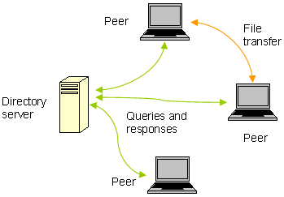
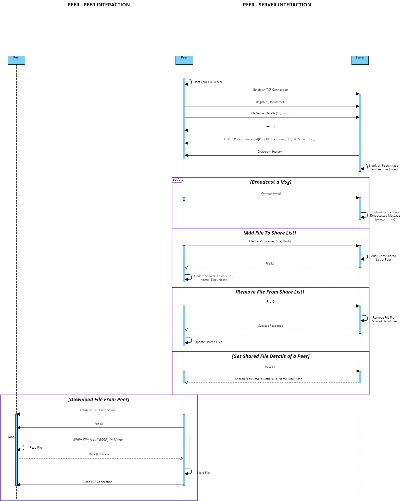

# Setup Guide

1. Open the setup (`LANit Installer.exe`).
2. Setup will automatically LANit in your system.
3. After installation, you will find the LANit executable on your desktop.

**Requirements:**
Windows OS 

**Note:** 
If you try to 'Connect' or 'Host Server', it may happen that your antivirus might stop and block `main.exe` from executing. This `main.exe` is the backend (Python) part which needs to run for LANit to work. If it does get blocked, mark the `main.exe` as safe in your antivirus program, then restart LANit. (I SWEAR it's not a virus.)

# Technology Used

**Backend:** Python, FastAPI  
**Frontend:** JavaScript, Electron, Svelte, DaisyUI

# Architecture

## Backend

The core functionality of LANit is to enable a user to download files from another user present in the same local area network directly without an Internet connection or any third-party servers. This indicates that we need a Peer-to-Peer architecture where each peer will have a server-side that continuously listens on a port for requests from other peers and a client-side that sends requests to other peers.

But wait, how will a peer know how many other peers are present in the LAN, what their IP addresses are, what port they are listening on, and what files they are sharing? There are multiple ways to solve this problem, but the solution used in this project is to introduce a centralized server that stores the IP address, port, and shared files metadata (like File Id, File Name, File Size, File Hash) of each peer and lets every other peer know about it.

The detailed interaction between Peer-Server and Peer-Peer is depicted in the image below.

